# CO₂ Emissions Data — Performance Report

Ветка: `performance`  
Технологии: React 19, TypeScript, Vite, Suspense (данные), мемоизация, виртуализация таблицы.

> Сравнение **V1 (до оптимизаций)** и **V2 (после)**.  
> Сценарии: Search, Sort, Year, Columns.  
> Примечание: панель **Interactions** в React DevTools для React 18/19 недоступна; действия фиксировались вручную.

---

## Фичи

- Загрузка ~100MB CO₂ JSON через Suspense ресурс (без стриминга; UI не блокируется).
- Список стран: имя, ISO, население (по выбранному году).
- Таблица по стране: `year`, `population`, `co2`, `co2_per_capita` + дополнительные колонки из модалки.
- Поиск по имени, фильтр по региону, сортировка по имени/населению, переключение года.
- Подсветка карточки при смене года.
- Виртуализация таблицы (`@tanstack/react-virtual`).
- Оптимизации: `React.memo`, `useMemo`, `useCallback`, `useDeferredValue`, стабильные `key`.

---

## Как профилировал

- **React DevTools Profiler** (актуальная/Canary) в dev-режиме.
- Сценарии:
  1. Поиск (`"an"` → очистить)
  2. Сортировка (`name ↔ population`, переключение `asc/desc`)
  3. Переключение года (несколько раз)
  4. Добавление/удаление колонок в модалке
- Для каждого сценария сняты **V1** и **V2**.
- Файлы скриншотов положены в `./screenshots/`:
  - `v1-<scenario>-flame.png`, `v1-<scenario>-ranked.png`
  - `v2-<scenario>-flame.png`, `v2-<scenario>-ranked.png`

---

## Результаты

> Δ рассчитывается как `(V2 - V1) / V1 * 100%` (меньше — лучше).

### 1) Search

| Метрика                  |                     V1 |                      V2 |          Δ |
| ------------------------ | ---------------------: | ----------------------: | ---------: |
| Commit duration (макс)   |            **83.1 ms** |             **25.1 ms** | **−69.8%** |
| Max component render     | YearTable: **58.3 ms** | AppContent: **12.6 ms** |          — |
| Компонент-топ по времени |              YearTable |              AppContent |          — |

**Flamegraph / Ranked:**  
V1: 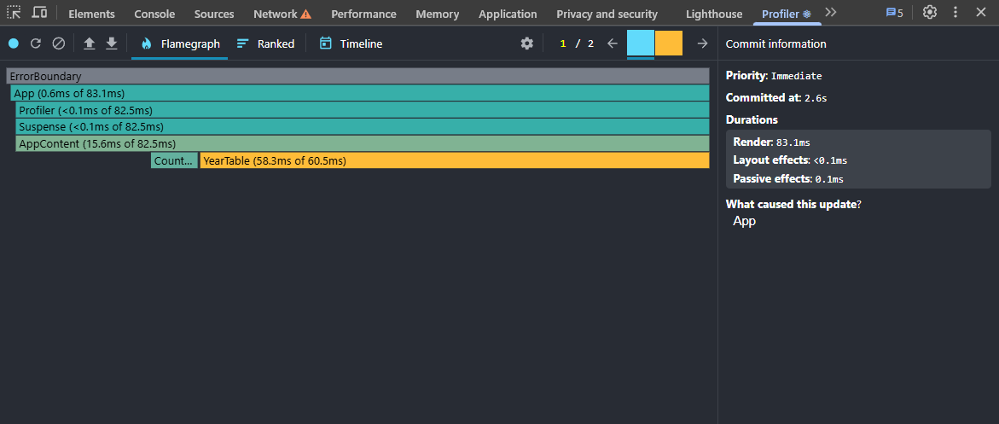 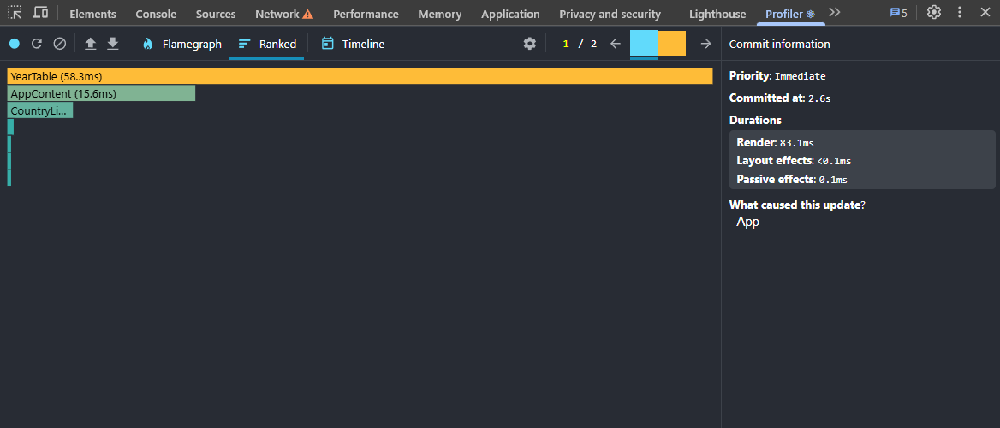  
V2: 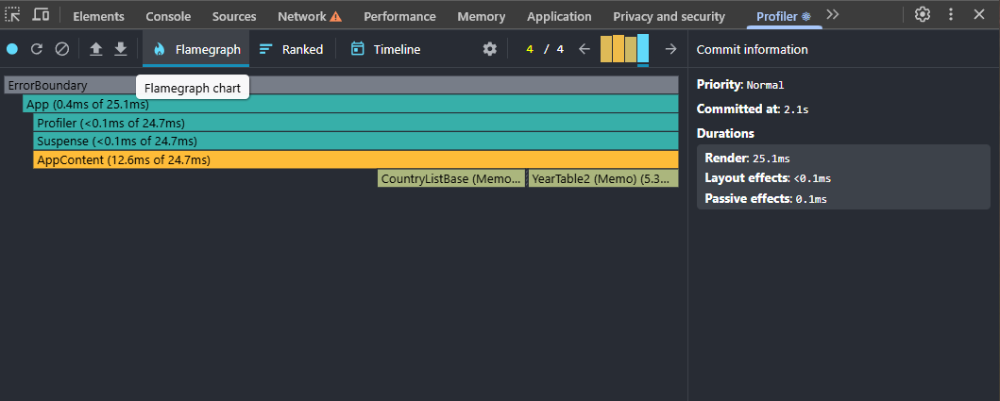 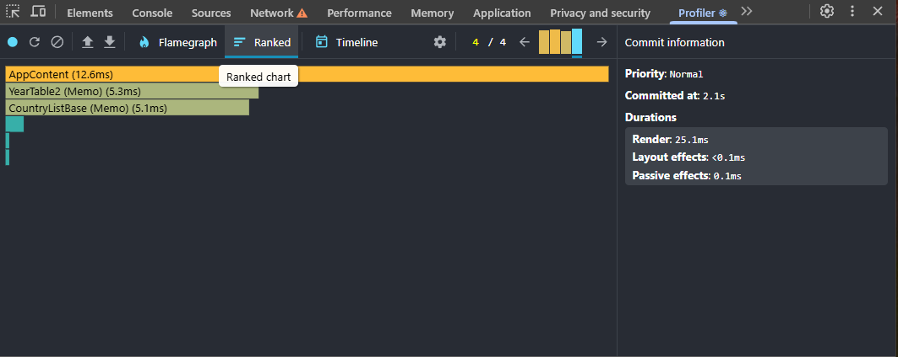

---

### 2) Sort

| Метрика                  |                     V1 |                      V2 |          Δ |
| ------------------------ | ---------------------: | ----------------------: | ---------: |
| Commit duration (макс)   |            **77.1 ms** |             **32.2 ms** | **−58.2%** |
| Max component render     | YearTable: **53.1 ms** | AppContent: **18.3 ms** |          — |
| Компонент-топ по времени |              YearTable |              AppContent |          — |

**Flamegraph / Ranked:**  
V1: 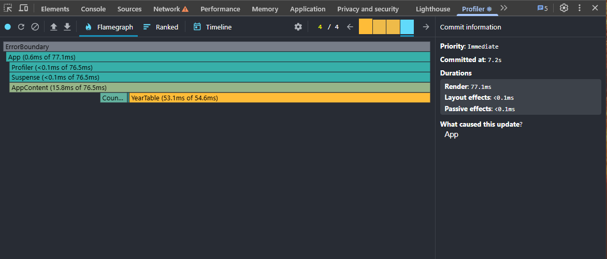 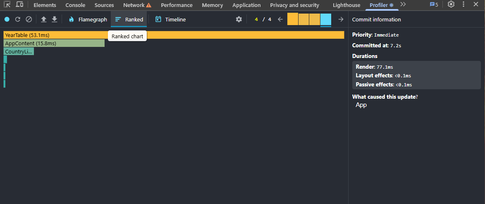  
V2: 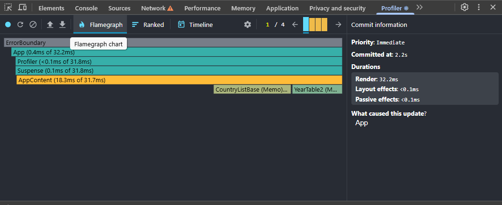 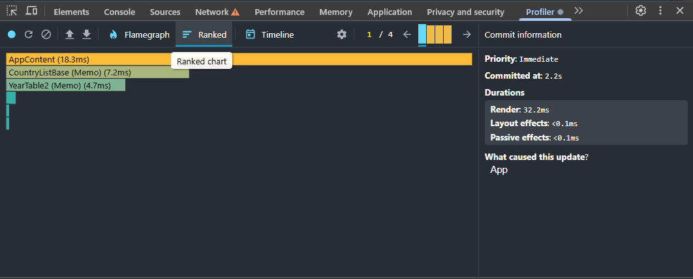

---

### 3) Year

| Метрика                  |                     V1 |                      V2 |          Δ |
| ------------------------ | ---------------------: | ----------------------: | ---------: |
| Commit duration (макс)   |            **93.0 ms** |             **30.8 ms** | **−66.9%** |
| Max component render     | YearTable: **63.4 ms** | AppContent: **18.4 ms** |          — |
| Компонент-топ по времени |              YearTable |              AppContent |          — |

**Flamegraph / Ranked:**  
V1: 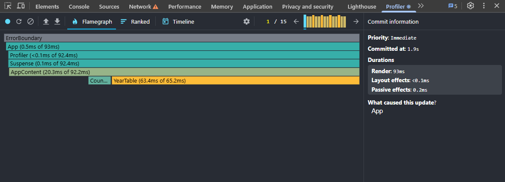 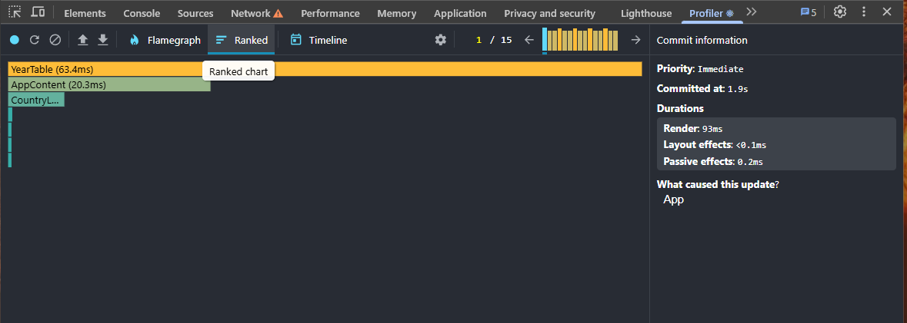  
V2: 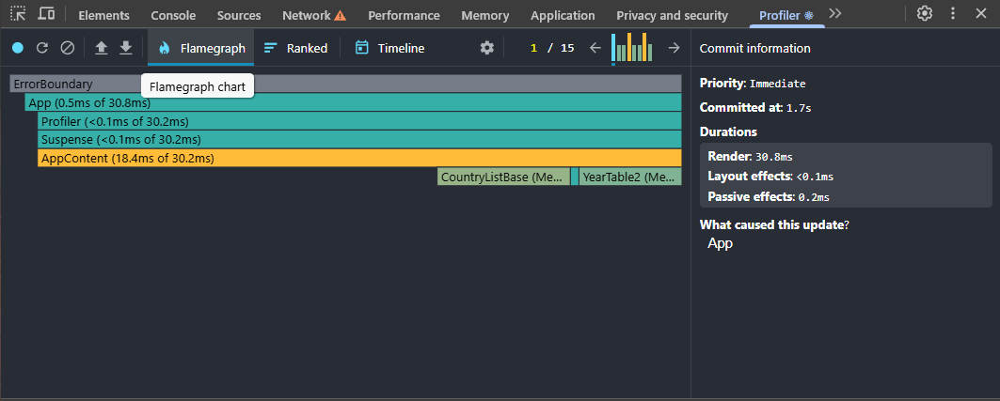 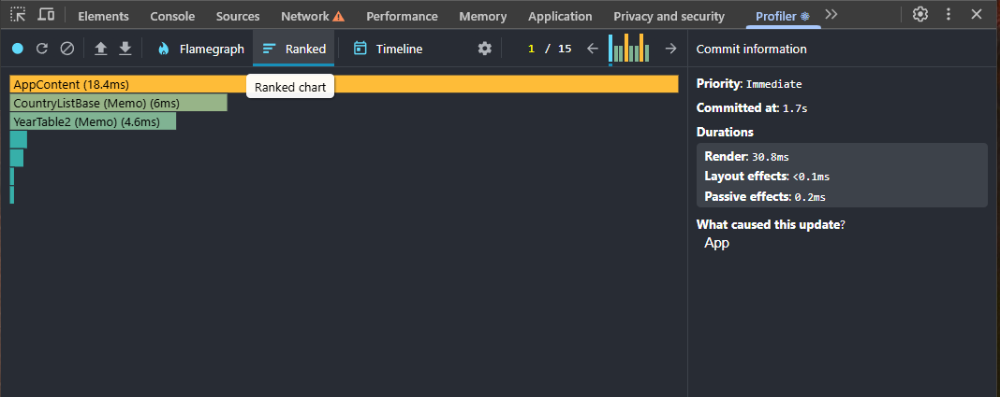

---

### 4) Columns

| Метрика                  |                     V1 |                      V2 |          Δ |
| ------------------------ | ---------------------: | ----------------------: | ---------: |
| Commit duration (макс)   |           **100.0 ms** |             **22.9 ms** | **−77.1%** |
| Max component render     | YearTable: **83.3 ms** | AppContent: **14.1 ms** |          — |
| Компонент-топ по времени |              YearTable |              AppContent |          — |

**Flamegraph / Ranked:**  
V1: 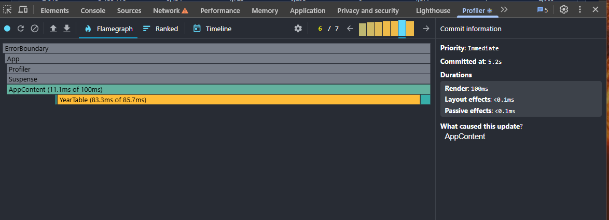 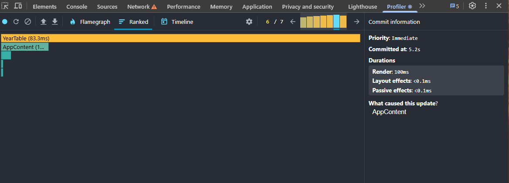  
V2: 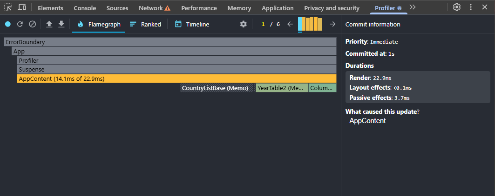 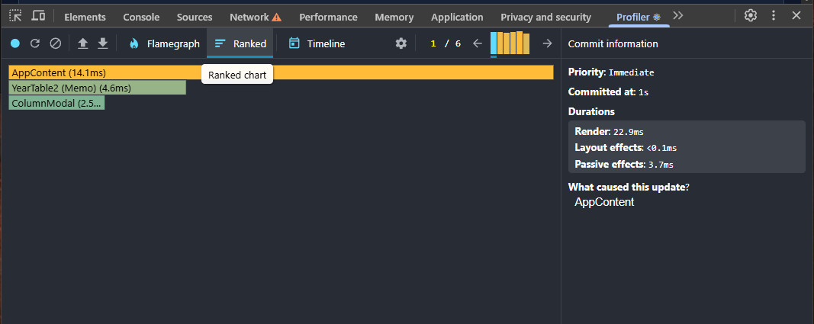

---

## Что именно улучшили

- `React.memo` на списковых и тяжёлых компонентах (`CountryList`, `CountryCard`, `YearTable`).
- `useMemo` для отфильтрованных/отсортированных списков и набора колонок.
- `useCallback` для хендлеров, чтобы пропсы были стабильны.
- `useDeferredValue` для поисковой строки.
- Виртуализация таблицы (`@tanstack/react-virtual`) вместо рендера всех строк.

---

## Известные ограничения / планы

- Парсинг большого JSON в main-потоке; можно вынести в Worker/stream.
- Кэширование в IndexedDB и повторное чтение.
- Снижение аллокаций в таблице (рециклинг строк).

---
